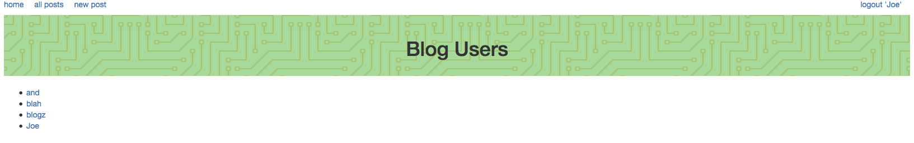
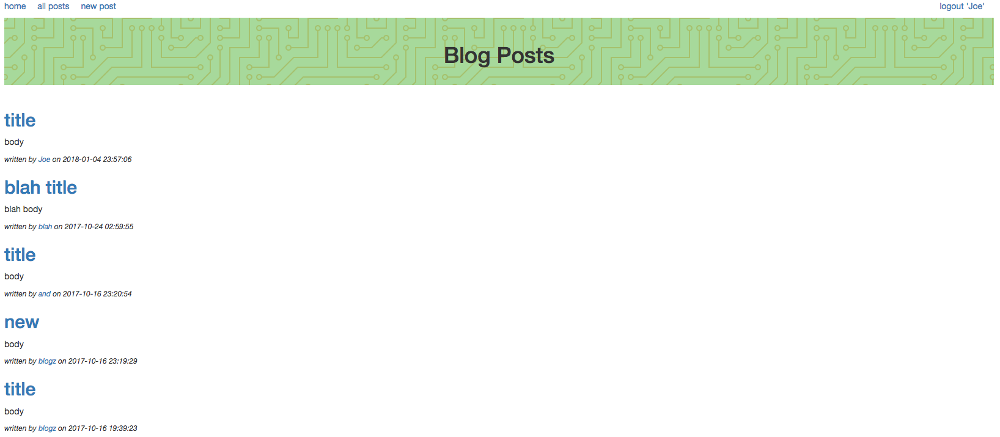
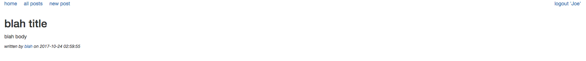
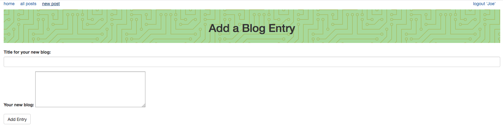

# Blog web application

This is a blogging web application implemented in Python using the Flask web framework and the Jinja2 templating 
engine.  It uses SQLAlchemy as an ORM to access a MySQL database containing a user and a blog table.

This application lets users signup, login, logout, create blog posts, view blog posts by an individual user 
or by all users. It hashes and salts user passwords before storing them in the database.
The purpose of the application is to demo the capabilities of a Flask web application.

# TODO

Add functionality to delete users and blog posts.

# Author
Jeff T

